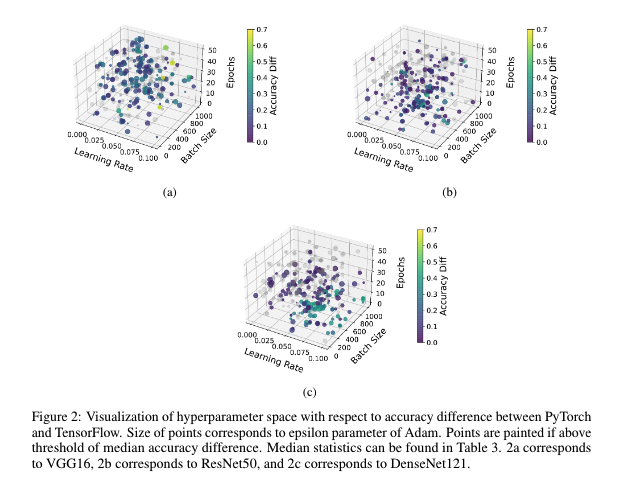

# CrossedWires
Welcome to the CrossedWires dataset. This is a Python package used in order to interact with our data, hosted on Google Cloud storage. 

All documentation on how to use the dataset and how to contribute can be found at: <https://crossedwires.readthedocs.io>. 

The dataset itself is licensed under CC-BY-4.0. 

  

