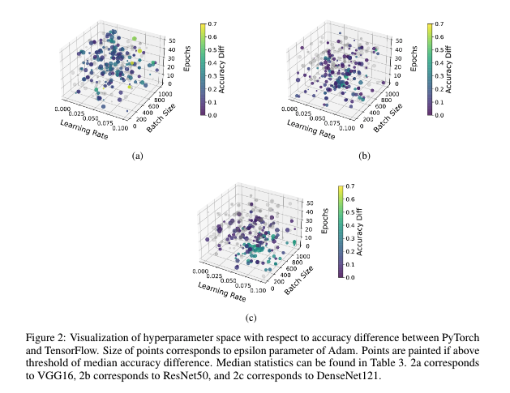

.. crossedwires documentation master file, created by
   sphinx-quickstart on Tue Aug 24 12:20:05 2021.
   You can adapt this file completely to your liking, but it should at least
   contain the root `toctree` directive.

Homepage
========

Welcome to the CrossedWires dataset! Here you'll find all the information
you'll need in order to start working with the trained models. If you're new to
the project, check out the overview tab for more information. If you know why
you're here, feel free to skip to the installation phase!

.. toctree::
   :hidden:

   overview
   installation
   tutorial
   key_links
   contribute

.. Indices and tables
.. .. ==================

.. .. * :ref:`genindex`
.. .. * :ref:`modindex`
.. .. * :ref:`search`
