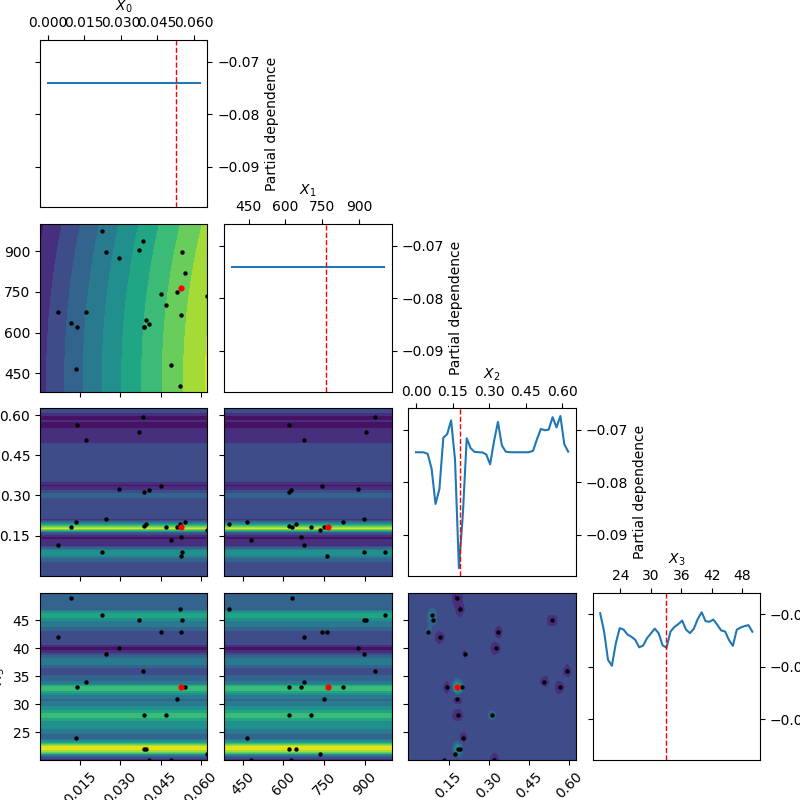

# Tutorial

Let's go through the different ways of interacting with the dataset. Through
the Python API, it's possible to pull dataframe files of the trials, `scikit-optimize`
objects which detail the Gaussian process-based search history, 
and the resulting models themselves.

For the purpose of this tutorial, we'll be working with VGG portion of the dataset.
However, the steps are the same for ResNet and DenseNet.

Let's start by loading and initializing the dataset class. 

```
>>> from crossedwires.cifar10 import ResNet50Dataset
>>> dataset = ResNet50Dataset()
```

## Trial Logs
There are multiple logs available as part of the dataset. They are returned as 
Pandas dataframe objects. 

One attribute is the Weights and Biases export. This is the preferred dataframe as it contains
all information in one spot. *Use this dataframe in order to lookup the name of 
the trial to pull a model. You can filter it as desired to isolate the names you 
need in order to load specific models.*
```
>>> dataset.wandb_dataframe()
                    Name  accuracy_diff  pt_test_acc  tf_test_acc     State Notes  ... time_since_restore  time_this_iter_s time_total_s  timestamp  timesteps_since_restore  training_iteration
0    dual_train_5e67eae2   6.815194e-01     0.099981       0.7815  finished     -  ...                NaN               NaN          NaN        NaN                      NaN                 NaN
1    dual_train_1295910a   6.561938e-01     0.756194       0.1000  finished     -  ...                NaN               NaN          NaN        NaN                      NaN                 NaN
2    dual_train_27594472   6.532896e-01     0.753290       0.1000  finished     -  ...                NaN               NaN          NaN        NaN                      NaN                 NaN
3    dual_train_878cb400   6.471333e-01     0.747133       0.1000  finished     -  ...                NaN               NaN          NaN        NaN                      NaN                 NaN
4    dual_train_11829286   6.318243e-01     0.731824       0.1000  finished     -  ...                NaN               NaN          NaN        NaN                      NaN                 NaN
..                   ...            ...          ...          ...       ...   ...  ...                ...               ...          ...        ...                      ...                 ...
395  dual_train_8e8ce4c6   4.170000e-10     0.100000       0.1000  finished     -  ...                NaN               NaN          NaN        NaN                      NaN                 NaN
396  dual_train_d7cca598   4.170000e-10     0.100000       0.1000  finished     -  ...                NaN               NaN          NaN        NaN                      NaN                 NaN
397  dual_train_f3ec2aae   4.170000e-10     0.100000       0.1000  finished     -  ...                NaN               NaN          NaN        NaN                      NaN                 NaN
398  dual_train_d24e215e   3.016354e-01     0.645135       0.3435  finished     -  ...                NaN               NaN          NaN        NaN                      NaN                 NaN
399  dual_train_d24f6410   2.114525e-03     0.699285       0.7014  finished     -  ...                NaN               NaN          NaN        NaN                      NaN                 NaN
```

The Ray Tune integration also generates log files, however they are split up
into the separate spaces searched. These are accessible using this command:
```
# specify a num argument to return a particular space, if num=None all spaces are returned 
>>> dataset.ray_tune_dataframes(num=None)
```

## Search Objects

As part of the integration with `scikit-optimize`, each overlapping space searched
generates an `OptimizeResult` object. These track the Gaussian processes which
are responsible for the optimization, and have
helpful utilities to understand the trajectory of the search. In addition, the
surrogate models used to guide the search are contained here. 

```
# specify a num argument to return a particular space, if num=None all spaces are returned 
>>> opt_results = dataset.optimizer_results(num=None)
```

The plotting utilities for these objects can be found [here.](https://scikit-optimize.github.io/stable/auto_examples/plots/visualizing-results.html#sphx-glr-auto-examples-plots-visualizing-results-py)

Here's an example of a plot we can generate, showing the partial dependency plots 
(generated using `skopt.plots.plot_objective`):


## Trained Model